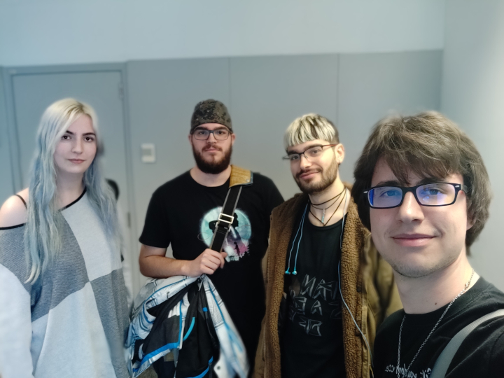

## **The Crossing**

Welcome to the official webpage of [Snow Bros](https://github.com/alexgesti/Snow-Bros.-Nick-and-Tom) from The Crossing.

The game is about knock out some enemies off the screen, throwing snow to them until they turn into a snowball and pushing it to kill the enemies. The game allows up to two players.
The story is about saving the land from King Scorch, that cursed the protagonists and turn them into snowmen, and captured the princess twins Teri and Tina.

### Snow Bros Gameplay

<video src="https://www.youtube.com/watch?v=y8kArjtCETc&feature=youtu.be" align="center" width="645" height="520" controls preload></video>
If the video doesn't works, see it on YouTube [here](https://www.youtube.com/watch?v=y8kArjtCETc&feature=youtu.be).

### Team Members

We are four students from UPC CITM studing the degree in Videogames design and developement:

**Alex Gesti**

+ Managment/Code/Art/Audio/Colliders/Levels/QA tester

 
**Lauren Montenegro**  

+ Audio/Art.

**Pau Motta** 

+ Art/Audio/Colliders/Web/Puntuation

**Raul Cano**

+ Art/UI/Colliders/Enemies UI/Snowball movement

### Release

Click here to download our last release.
<a href="https://github.com/alexgesti/Snow-Bros.-Nick-and-Tom/releases/download/1.0/TheCrossing_SnowBros.Nick.Tom_v1.0.zip" download="Snow Bros - 0.5">
                       Snow Bros - Download
                      </a>

### Contact Us!

You can contact us by sending an e-mail to:

alexgesti001@gmail.com

laurenmj187@gmail.com

paumottar@gmail.com

raulcano5.rc@gmail.com
